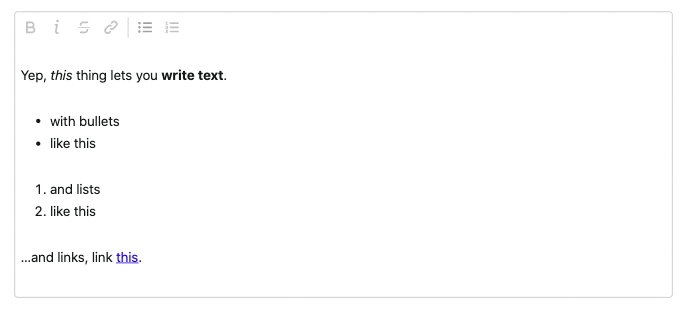

📝 Another Rich Text Editor
===



Just a simple, themable, rich-*ish* text editor for React. Can it do everything? Nope. But it can do more than nothing and is super easy to use.

* ⌨️ Written in Typescript
* 🛠️ Built on top of [Prosemirror](https://prosemirror.net)
* 🙏 Couldn't be done without [rich-markdown-editor](https://github.com/outline/rich-markdown-editor) and [tiptap](https://github.com/scrumpy/tiptap).

> ⚠️ This editor was built to support [Launchbot](https://www.launchbot.app). If you are looking for something more powerful (i.e. inline images, custom view components, embeds), look elsewhere. While we may add these features over time, ARTE isn't there today. Check out [Remirror](https://github.com/remirror/remirror), or try building something from scratch using Prosemirror.

## Demo
Live demo running [here](https://editor.launchbot.vercel.app/), or clone the repo to run the [example usage locally](#local-development).

## Usage

### Installation
```javascript
import Editor from "@launchbot/editor";

const handleChange = value => {
  // or store in database, save to form state etc.
  localStorage.setItem("saved", JSON.stringify(value));
}

<Editor
  readOnly={false}
  placeholder={"A thousand words are worth...a thousand words"}
  onChange={handleChange}
/>
```

### Props

#### `readOnly (default: false)`
Set editor to read only view, which hides toolbars

#### `placeholder`
Placeholder text for an empty editor. 

#### `initialValue`
String representing initial editor value. Can pass either plain text or a Document object, which represents the editor content with formatting.

#### `onChange(value): void`
Callback fired on editor changes. See the [examples](/example/src/index.js) for how to receive and persist the editor content.

#### `onFocus(): void`
Callback fired when editor is focused.

#### `onBlur(): void`
Callback fired when editor loses focus.

#### `theme (default: light)`
Provide a custom theme for the editor. See the [examples](/example/src/index.js) for usage, or use one of the built-in light/dark themes [here](/src/theme.ts).

## Local Development
To run the demo locally:
```bash
npm install
npm run start
```